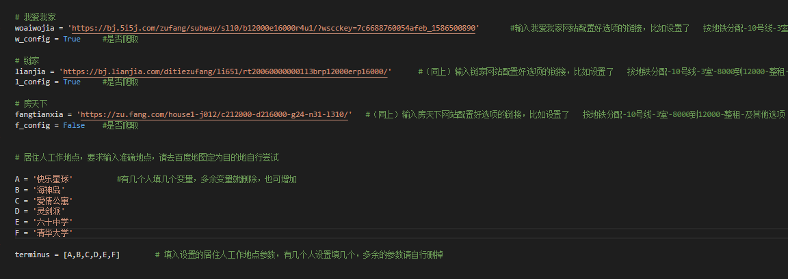
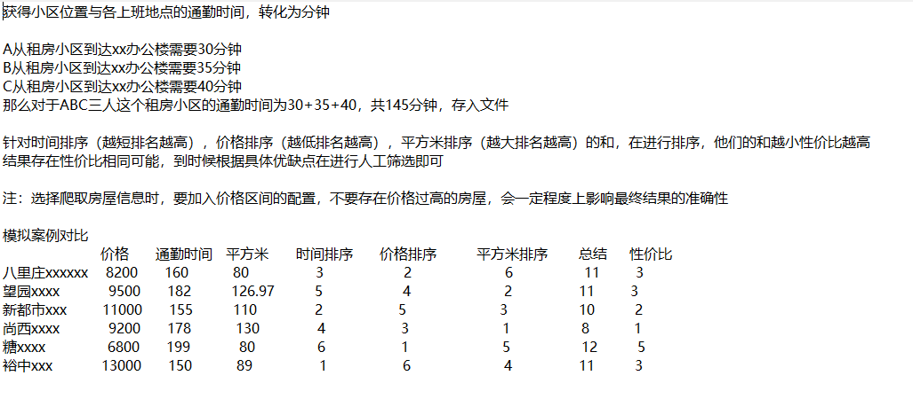
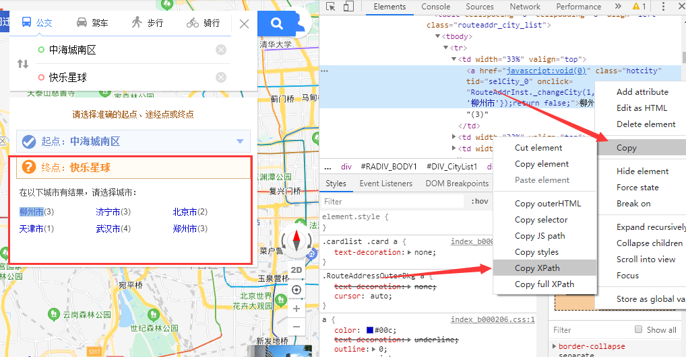

### FindHouse Three_for_one
帮助你在成百上千的房源中找到性价比最高的房屋，以便人工进行再次筛选，用最短的时间找到最适合你的房屋！

* pip3 install -r requirments.txt    #安装python模块

* python3 Three_for_one.py         #前提是已配置目标py的url

* python3 Rank.py         #出现性价比排名结果

### Config：

* 1.打开Three_for_one.py文件，填入各平台配置完房屋选项的当时url（务必配置价格区间，越准确越好）和是否开启此平台的爬虫

* 2.填入居住人的准确工作地点，以便计算小区到工作地点的通勤时间

### 工具介绍：

* 收集 我爱我家，链家，房天下的房屋信息并最终按照房屋性价比进行排名

* 具体性价比计算公式：获得(自己和任意数量的合租伙伴)房屋居住人通勤时间总和排序（越短排名越高），价格排序（越低排名越高），平方米排序（越大排名越高）的和，在进行排序，他们的和越小性价比越高
结果存在性价比相同可能，到时候根据具体优缺点在进行人工筛选即可

* house_info.txt： <= 存储爬取的租房平台房屋的，小区名称，价格，平方米的文件

* house_result.txt： <= 计算完通勤时间出现的文件，增加了 居然人通勤时间的信息

* 最终性价比排名.txt： <= 顾名思义，所有房源的性价比最终结果，当然运行Rank.py时cmd界面也是有输出的，输出结果为前10名，同时不用担心存在相同性价比的和影响最终排名的，性价比相同的已设置为相同排名，再根据优缺点挑选即可

写完之后才发现房天下的数据意义不大（存在钓鱼房源或者无法及时更新且没有举报按钮）
所以推荐只爬取链家和我爱我家就可以， 链家和贝壳是同一个数据库，安居客存在机制，无法获取小区名称，并且个人感觉数据真实性也有点问题，未列入目标平台（有喜欢的也可以自己写其他平台爬虫，最终生成txt格式一样就可以）

大概流程： 爬虫-百度地图-计算性价比

### 注意：
* 1.工作地点名称要准确，最好到百度地图上自己确定
* 2.运行到通勤时间计算会运算很长时间，以小时为单位，请做好长时间开机准备，尽量控制房源在几百套，所以价格区间越准确越好，防止百度地图运行到晚上，因为晚上百度地图就无法计算通勤时间了，获得通勤时间需要用到百度地图
* 3.除去北京市的其他城市，可能会遇到房源小区名在百度地图上显示多个城市的选项，需要自行获得xpath替换代码baidu.py/178行

